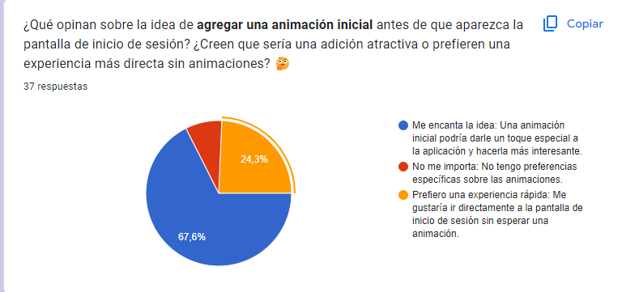
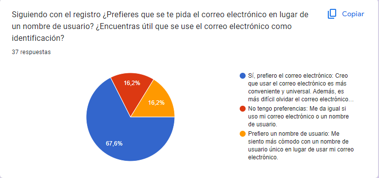
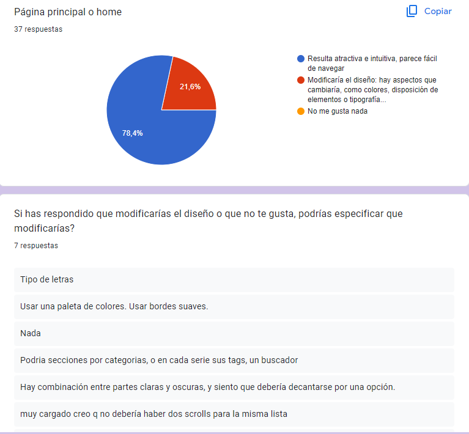
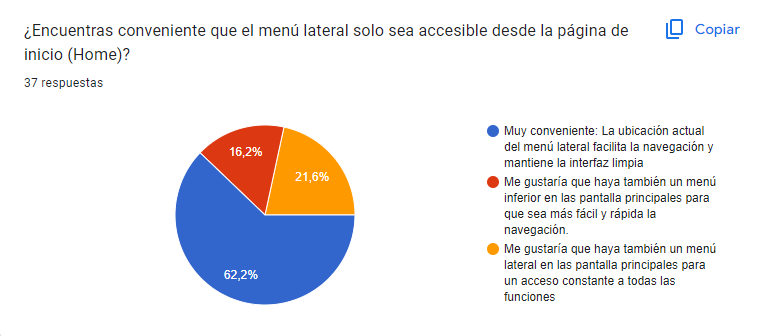
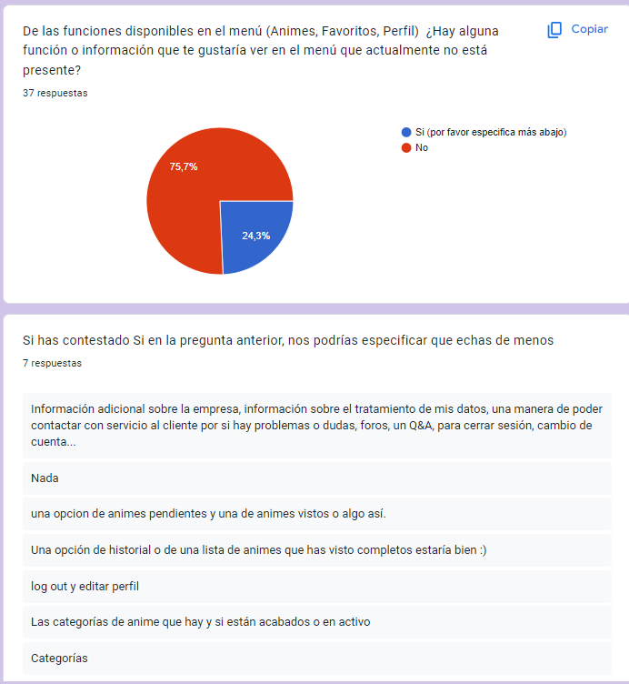
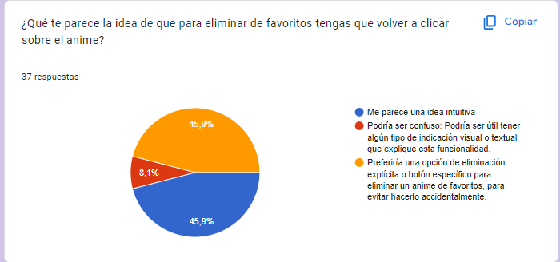
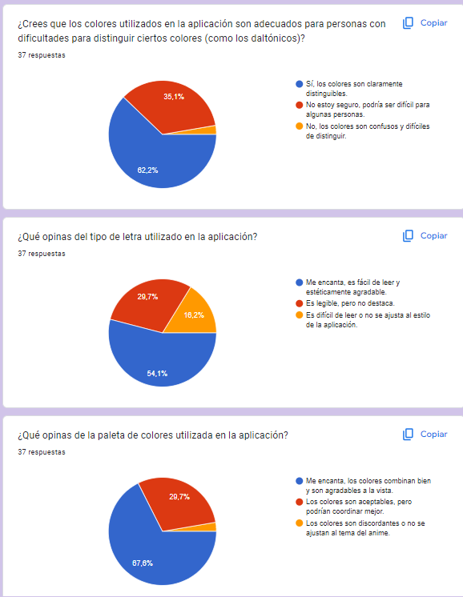

# Página de diseño 

## Estilo y Diseño

Hemos decidido darle un estilo "Aesthetic", enfocado mas en el mundo cultural del anime, adaptando asi al maximo a la tematica de la aplicación, para que al usuario,
le parezca divertida y agradable. En toda la aplicacion hemos seguido el mismo estilo utilizando colores como el morado, el negro y el blanco, asi como un fondo de pantalla
general para todas las pantallas.

### MockUp
Aqui os mostramos un ejemplo el diseño de una de nuestras pantallas, en este caso el Login, donde se aprecia este estilo "Aesthetic" y una paleta de colores de un morado suave donde se aprecia
una calle japonesa, junto con el logo de la aplicacion y los campos donde hay que insertar nuestras credenciales para poder acceder.

### Comparativa y toma de decisiones
Dentro de los parámetros establecidos, hemos mantenido la integridad del diseño original, realizando solo ajustes en los estilos de los TextInput y las Cards de los animes.
Además, hemos limitado la función de "likes" a la página específica de cada anime, eliminando la opción de puntuación. Asimismo, hemos mejorado el diseño de las páginas individuales de los animes,
otorgándoles una apariencia más atractiva y organizada.
En conclusion el diseño original nos ha parecido bien desde un principio y hemos decidido hacerle unos cambios minimos

#### Pantallas:

  
   
  

---

### Prueba Usabilidad

---
Encuesta completa: https://docs.google.com/forms/d/1mFxsvQhIMP46RzGGHwn7x0_mmF-gHqfOAinsNkuEFUk/edit#responses

---

Hemos llevado a cabo pruebas de usabilidad en nuestra aplicación. Un total de **37 usuarios** participaron en estas pruebas, 
proporcionando comentarios y perspectivas (hay que tener en cuenta que consideramos que las respuestas no son muy objetivas, ya que, muchos son amigos y familiares).

Las pruebas se centraron tanto en el aspecto estético como en la funcionalidad de la aplicación. Los usuarios evaluaron la 
interfaz de usuario, la facilidad de navegación, la coherencia del diseño y la intuitividad de las funciones.

El objetivo de estas pruebas de usabilidad era identificar áreas de mejora y recoger opiniones generales sobre el funcionamiento 
de la aplicación. Los comentarios de los usuarios nos ayudarán a entender mejor qué es lo que le falta a nuestra aplicación y 
cómo podemos mejorar la experiencia del usuario.

Los resultados de estas pruebas se utilizarán para mejorar nuestras decisiones de diseño y desarrollo a medida que continuamos 
mejorando nuestra aplicación.

Se han realizado un total de 26 preguntas de todo tipo y estas son las que consideramos las más relevantes:

Una de las preguntas clave que se plantearon durante las pruebas de usabilidad fue si los usuarios apreciarían una animación inicial antes de la pantalla de inicio de sesión. La pregunta buscaba entender si los usuarios encontrarían atractiva esta adición o si preferirían una experiencia más directa sin animaciones.

Los resultados fueron bastante reveladores, con un 67.6% de los usuarios expresando entusiasmo por la idea de agregar una animación inicial (pero también consideramos que las personas que lo han contestado son nuestros amigos y familiares por lo que creo que hay porcentaje que no les gusta la animación inicial en las aplicaciones).
Nosotros consideramos que podría añadir un elemento de interés visual y un inicio más divertido para el usuario.

Por otro lado, el 32.4% restante de los usuarios indicó una preferencia por una experiencia más rápida. Este grupo valoró la eficiencia y la rapidez en el acceso a la funcionalidad de la aplicación por encima de los elementos estéticos adicionales.

Otra pregunta importante que se planteó durante las pruebas de usabilidad fue si los usuarios preferirían que se les pidiera el correo electrónico en lugar de un nombre de usuario para el registro, y si consideraban útil el uso del correo electrónico como identificación.

Los resultados mostraron una variedad de opiniones. Un 67.6% de los usuarios estuvo a favor de usar el correo electrónico como identificación. Este grupo de usuarios encontró útil la idea de usar el correo electrónico para el registro, ya que esto podría simplificar el proceso de inicio de sesión y recuperación de la cuenta.

Sin embargo, un 16.2% de los usuarios no estuvo de acuerdo con esta idea. Este grupo prefiere mantener su correo electrónico privado.

Además, el 16.2% restante no tenía una preferencia clara, están cómodo con ambas opciones o puede que no vea una diferencia significativa entre ellas.

Pedimos a los usuarios que especificaran qué aspectos del diseño modificarían si no les gustaba o si pensaban que necesitaba mejoras. Recibimos una variedad de respuestas a considerar para mejorar la experiencia del usuario:

- **Tipo de letras:** sugirieron que el tipo de letra podría ser modificado para mejorar la legibilidad o la estética de la aplicación.
- **Paleta de colores y bordes suaves:** expresaron el deseo de una paleta de colores diferente y bordes más suaves en los elementos de la interfaz.
- **Secciones por categorías, tags en series, buscador:** se nos sugirió la posibilidad de organizar el contenido en secciones por categorías, añadir tags a cada serie y un buscador para facilitar la navegación.
- **Combinación de partes claras y oscuras:** señaló la combinación de partes claras y oscuras en el diseño, sugiriendo que la aplicación debería decantarse por una opción.
- **Doble scroll en la misma lista:** el diseño estaba muy cargado y sugirió que no debería haber dos scrolls para la misma lista.
- **Transparencia del fondo y tamaño de la tipografía:** Un usuario mencionó que las letras negras/grises eran difíciles de ver y sugirió cambiar la transparencia del fondo o el tamaño de la tipografía para mejorar la legibilidad.

Esta pregunta nos pareció muy útil para saber si lo que habíamos diseñado encaja con el usuario y los comentarios nos proporcionan una guía útil sobre las áreas de diseño que podríamos considerar mejorar la aplicación.

Otra de las preguntas que se planteó durante las pruebas de usabilidad fue si los usuarios encontraban conveniente que el menú lateral solo fuera accesible desde la página de inicio (Home). Esta pregunta fue particularmente importante para nosotros, ya que inicialmente solo habíamos implementado un menú en una sola pantalla.

Los resultados mostraron que un 21.6% de los usuarios echan de menos un menú en otras pantallas. Este grupo de usuarios expresó la necesidad de tener acceso al menú lateral desde otras pantallas, no solo desde la página de inicio. Esto sugiere que valoran la capacidad de navegar fácilmente a diferentes secciones de la aplicación sin tener que volver a la página de inicio.

Se preguntó si había alguna función o información que les gustaría ver en el menú que actualmente no está presente. Recibimos una variedad de respuestas:

- **Información adicional sobre la empresa, tratamiento de datos, contacto con servicio al cliente, foros, Q&A, cierre de sesión, cambio de cuenta:** Algunos usuarios expresaron el deseo de tener más información sobre la empresa, cómo se tratan sus datos, y cómo pueden contactar con el servicio al cliente. También sugirieron la inclusión de foros, una sección de preguntas y respuestas (Q&A), y opciones para cerrar la sesión y cambiar de cuenta.
- **Animes pendientes y animes vistos:** Un usuario sugirió la posibilidad de tener una opción en el menú para animes pendientes y animes vistos.
- **Historial o lista de animes completos:** Un usuario expresó el deseo de tener una opción de historial o una lista de animes que ha visto completos.
- **Log out y editar perfil:** Un usuario sugirió la inclusión de opciones para cerrar la sesión (log out) y editar el perfil (creo que no se ha fijado que si hay acceso al perfil desde el menu lateral donde puede editar, eliminar o cerrar sesión).
- **Categorías de anime y estado (acabados o en activo):** Un usuario expresó el deseo de ver las categorías de anime y si están acabados o en activo.

Se planteó la pregunta a los usuarios sobre qué les parecía la idea de que para eliminar un anime de favoritos tuvieran que volver a hacer clic sobre el anime. Los resultados mostraron una división igual, con un 50% de los usuarios a favor y un 50% en contra.

Algunos pueden encontrar útil la funcionalidad actual, ya que evita la eliminación accidental de animes de la lista de favoritos. Sin embargo, otros pueden preferir una opción más directa para eliminar animes de la lista de favoritos sin tener que navegar de nuevo al anime.

Esto nos hacen plantear la posibilidad de modificar el diseño para hacer la eliminación más directa.

Durante las pruebas de usabilidad, algunos usuarios sugirieron cambios en la paleta de colores de la aplicación. Específicamente, expresaron el deseo de tener colores más claros en el diseño. Este feedback es valioso, ya que, los colores juegan un papel crucial en la estética de la aplicación y en la experiencia del usuario.

Los colores más claros pueden mejorar la legibilidad y hacer que la aplicación sea más atractiva y fácil de usar. Sin embargo, también es importante considerar otros factores como la coherencia del diseño y que vaya acorde con la aplicación que estamos preparando.

