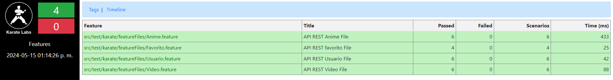
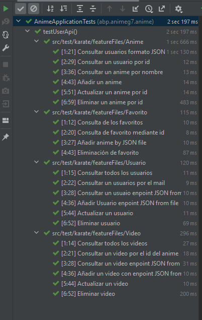

# Página de implementación

## Estructura del Back

Hemos dividido el proyecto por carpetas para facilitar su localización. La estructura es la siguiente:

- **Java**:
    - **Dao**: Maneja la interacción con la base de datos de las diferentes clases creadas.
    - **Model**: Contiene las clases utilizadas en el proyecto.
    - **Service**: Encargado de toda la lógica del programa.
    - **API**: Contiene las clases controladoras para manejar las solicitudes HTTP.

En **Dao**, hemos creado clases separadas para manejar la interacción con la base de datos. Esto se ha hecho para mantener un enfoque ordenado y facilitar las modificaciones.

En **Modelo**, se han creado clases con atributos, getters, setters y el método toString para las diferentes entidades del proyecto.

El **Service** maneja la lógica del proyecto, gestionando diferentes operaciones.

En **API**, se encuentran las clases controladoras que manejan las solicitudes HTTP entrantes y dirigen el flujo de ejecución adecuado a través del servicio correspondiente.

#### DAO

- ***Clases para interactuar con la base de datos y manejar operaciones de inserción, actualización y eliminación***

  - **AnimeRepository**: Gestiona las operaciones relacionadas con los animes en la base de datos.
  - **FavoritoRepository**: Gestiona las operaciones relacionadas con los favoritos en la base de datos.
  - **UserRepository**: Gestiona las operaciones relacionadas con los usuarios en la base de datos.
  - **VideoRepository**: Gestiona las operaciones relacionadas con los videos en la base de datos.
  - **HandlerSax**: Clase SAX personalizada para parsear un documento XML y crear objetos Java (`Anime`, `Video`, `User`, `Favorito`) a partir de él.

#### Modelo

- ***Clases que representan las entidades del sistema***

  - **Anime**: Representa un anime con diferentes atributos como `id`, `name`, `description`, etc.
  - **Favorito**: Representa los favoritos de los usuarios.
  - **User**: Modelo para usuarios con atributos como `name`, `email`, `password`, etc.
  - **Video**: Modelo para videos asociados a los animes.

#### Service

- ***Maneja la lógica del proyecto, gestionando diferentes operaciones***

  - **AnimeService**: Gestiona las operaciones relacionadas con los animes, como obtener, agregar, actualizar y eliminar animes.
  - **FavoritoService**: Maneja las operaciones relacionadas con los favoritos de los usuarios.
  - **UserService**: Maneja las operaciones relacionadas con los usuarios, como registro, inicio de sesión, etc.
  - **VideoService**: Gestiona las operaciones relacionadas con los videos asociados a los animes.

#### API

- ***Contiene las clases controladoras para manejar las solicitudes HTTP***

  - **AnimeController**: Controlador para gestionar las solicitudes relacionadas con los animes, como obtener, agregar, actualizar y eliminar animes.
  - **FavoritoController**: Controlador para manejar las solicitudes relacionadas con los favoritos de los usuarios.
  - **UserController**: Controlador para gestionar las solicitudes relacionadas con los usuarios, como registro, inicio de sesión, etc.
  - **VideoController**: Controlador para gestionar las solicitudes relacionadas con los videos asociados a los animes.

## Responses (Test Unitarios)

Para realizar pruebas unitarias con Karate en los métodos y respuestas de las clases Anime, Favorito, Usuario y Video, hemos seguido un enfoque estructurado y sistemático. 
Primero, definimos escenarios de prueba en archivos `.feature`, donde cada archivo se enfoca en un aspecto específico del sistema. 
En estos archivos, configuramos las solicitudes (GET, POST, PUT, DELETE) y las respuestas esperadas.  
Karate nos permite simular las respuestas del servidor y validar los datos retornados, asegurando que cada método funcione según lo esperado bajo diferentes condiciones y entradas. 
Esto garantiza que nuestro sistema sea robusto y funcione correctamente antes de su implementación.

---

---
 - **Test de Karate Labs**
---

- **Test de IntelIJ**
---
